# torture-bench

### A multi-module, open-source CPU benchmark built on one principle: if the score cannot be explained, the score cannot be trusted.

> *"The purpose of a benchmark is not to produce a number. It is to produce understanding. If you walk away with a number and no understanding, the benchmark failed — not your hardware."*

**One command. Any machine. Fair scores.**

---

## Table of Contents

- [Quick Start — All Platforms](#quick-start--all-platforms)
- [Windows ARM (Snapdragon) — Start Here](#windows-arm-snapdragon--start-here)
- [Understanding Your Results](#understanding-your-results)
- [Viewing the Scoreboard](#viewing-the-scoreboard)
- [Customizing Your Run](#customizing-your-run)
- [For Developers](#for-developers)
- [Project Structure](#project-structure)
- [Why torture-bench Exists](#why-torture-bench-exists)
- [The Logical Fallacies of Modern Benchmarking](#the-logical-fallacies-of-modern-benchmarking)
- [Why One-Number Benchmarks Are Not Enough](#why-one-number-benchmarks-are-not-enough)
- [Why Closed-Source Benchmarks Create a Trust Problem](#why-closed-source-benchmarks-create-a-trust-problem)
- [Why Randomness Matters in Benchmarking](#why-randomness-matters-in-benchmarking)
- [Why Mixing Algorithms Matters](#why-mixing-algorithms-matters)
- [Why Unpredictability Matters](#why-unpredictability-matters)
- [Why Matching Core Counts Can Matter](#why-matching-core-counts-can-matter)
- [What Latency Is, and Why Memory Speed Can Still Be Useless](#what-latency-is-and-why-memory-speed-can-still-be-useless)
- [What Pipelining Is](#what-pipelining-is)
- [What Branches Are, and Why They Hurt](#what-branches-are-and-why-they-hurt)
- [The Anatomy of a Misleading Benchmark (Code Walkthrough)](#the-anatomy-of-a-misleading-benchmark-code-walkthrough)
- [How Honest Benchmarks Differ (Code Walkthrough)](#how-honest-benchmarks-differ-code-walkthrough)
- [When Benchmarks Become Decision-Making Tools: The Real Danger](#when-benchmarks-become-decision-making-tools-the-real-danger)
- [Why a Good CPU Benchmark Needs Both Friendly and Hostile Patterns](#why-a-good-cpu-benchmark-needs-both-friendly-and-hostile-patterns)
- [Why This Benchmark Is Beta](#why-this-benchmark-is-beta)
- [Why I Made This for Myself First](#why-i-made-this-for-myself-first)
- [Design Goals](#design-goals)
- [Summary](#summary)

---

## Quick Start — All Platforms

### Mac / Linux / WSL

```bash
curl -sL https://raw.githubusercontent.com/sunprojectca/torture-bench/main/bench.sh | bash
```

### Windows (PowerShell)

```powershell
irm https://raw.githubusercontent.com/sunprojectca/torture-bench/main/bench.ps1 | iex
```

### With Geekbench Scores (Optional — Enables Comparison)

```powershell
$env:GB_SINGLE=2800; $env:GB_MULTI=18000; irm https://raw.githubusercontent.com/sunprojectca/torture-bench/main/bench.ps1 | iex
```

The script will:

1. Download the code
2. Install any missing build tools (cmake, ninja, compiler)
3. Compile for your machine's native architecture
4. Run the full benchmark suite (~3 minutes)
5. Save a formatted report to your Desktop

> The benchmark runs entirely locally. No tokens, no Python required.

Results are saved as:

- `results/bench_<os>_<arch>_<host>_<timestamp>.json` — structured data
- `results/bench_<os>_<arch>_<host>_<timestamp>.txt` — human-readable report


---

## Windows ARM (Snapdragon) — Start Here

Most issues people hit are on Windows ARM laptops (Snapdragon X Elite / Plus, etc.). Here is the fast path.

### One-liner (PowerShell)

```powershell
irm https://raw.githubusercontent.com/sunprojectca/torture-bench/main/bench.ps1 | iex
```

This downloads, builds for ARM64, runs all 20 modules, and saves results to your Desktop. Takes ~3 minutes.

### Manual build (if the one-liner fails)

```bat
git clone https://github.com/sunprojectca/torture-bench.git
cd torture-bench
mkdir build && cd build
cmake .. -G "Visual Studio 17 2022" -A ARM64
cmake --build . --config Release
cd ..
build\Release\torture-bench.exe --tune -d 10 -o results\my_run.json --json
```

> **Key flag:** `-A ARM64` — without this, CMake defaults to x64 and the binary runs under emulation (slower and wrong).

### Verify your binary is really ARM64

```powershell
dumpbin /headers build\Release\torture-bench.exe | Select-String "machine"
```

You should see **`AA64`** (ARM64). If you see `8664` (x64) you built the wrong arch.

### Why this matters — a real-world example of benchmark self-deception

Building x64 on an ARM64 machine and then running the benchmark is not just "slower." It is a textbook case of measuring the wrong thing. The x64 binary runs under Windows' emulation layer, which adds translation overhead on every instruction. Your "benchmark score" now measures emulation efficiency, not your CPU. This is exactly the kind of silent measurement corruption that torture-bench was built to expose.

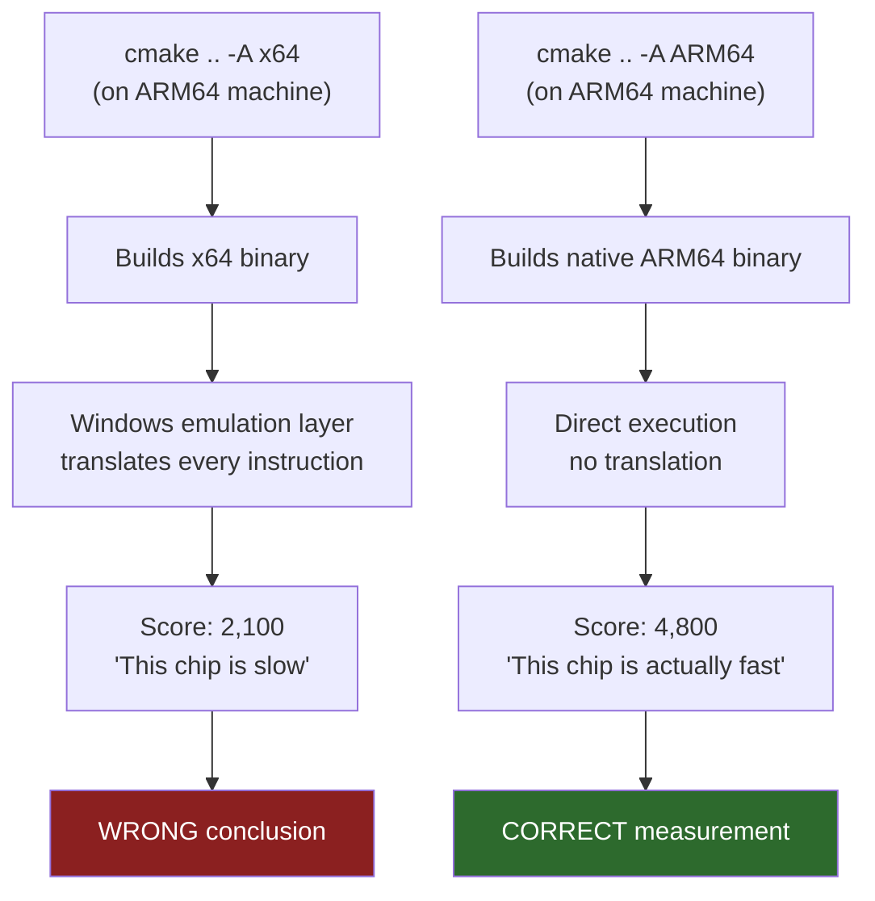

### Common Problems and Fixes

| Problem | Cause | Fix |
|---|---|---|
| `cmake` says "no generator found" | Visual Studio not installed or wrong version | Install [VS Build Tools 2022](https://visualstudio.microsoft.com/downloads/#build-tools-for-visual-studio-2022) with "Desktop development with C++" |
| Build succeeds but runs slow | Built x64 instead of ARM64 — runs under emulation | Rebuild with `-A ARM64` instead of `-A x64` |
| `LNK1104: cannot open file 'kernel32.lib'` | ARM64 Windows SDK/libs not installed | In VS Installer, add "MSVC ARM64/ARM64EC build tools" and "Windows SDK" |
| `cmake` picks Ninja instead of MSVC | Ninja on PATH (e.g. from Android SDK) | Explicitly pass `-G "Visual Studio 17 2022"` |
| Script fails with "not recognized" | Running `.sh` script in PowerShell or `.ps1` in cmd | Use `bench.ps1` in PowerShell, `bench.sh` in bash/WSL |
| Crash or illegal instruction | Running an x64 binary on ARM64 | Delete `build/`, rebuild with `-A ARM64` |
| RAM shows as -0.4 GB | Known cosmetic bug on some Snapdragon devices | Ignore — does not affect scores |
| `xcode-select` error on Mac | Not on Mac — wrong script | Use `bench.ps1` on Windows, `bench.sh` on Mac |
| `Access is denied` running `.ps1` | PowerShell execution policy | Run `Set-ExecutionPolicy -Scope Process Bypass` first |

---

## Understanding Your Results

After the benchmark runs, you will see output like this:

```
  ╔═══════════════════════════════════════════════════════╗
  ║         TORTURE-BENCH  v1.0  CPU Fairness             ║
  ╚═══════════════════════════════════════════════════════╝

  Platform:
  OS      : macOS
  Arch    : arm64
  CPU     : Apple M2 Pro
  Cores   : 12 logical
  RAM     : 32.0 GB
  SIMD    : NEON
  SOC     : Apple Silicon
```

Then each module runs and prints its score. At the end:

```
  Composite Score: 5068.30
  Coprocessor Warnings: 1
  Verdict: MINOR_ACCELERATION_DETECTED
```

### What the verdict means

| Verdict | Meaning |
|---|---|
| **PURE_CPU_FAIR** | All tests ran on the CPU with no hidden acceleration. Clean score. |
| **MINOR_ACCELERATION_DETECTED** | One or two tests may have used hardware accelerators (like AES-NI for encryption). Scores are still mostly fair. |
| **SIGNIFICANT_ACCELERATION_DETECTED** | Multiple tests detected coprocessor use. The composite score is inflated compared to pure CPU performance. |

A "minor" verdict is normal on modern hardware — almost every CPU made after 2015 has AES-NI encryption acceleration. It does not mean anything is wrong.

### What the modules test

These 20 modules fall into a few categories: core throughput, memory and cache behavior, speculation and pipeline stress, and accelerator detection.

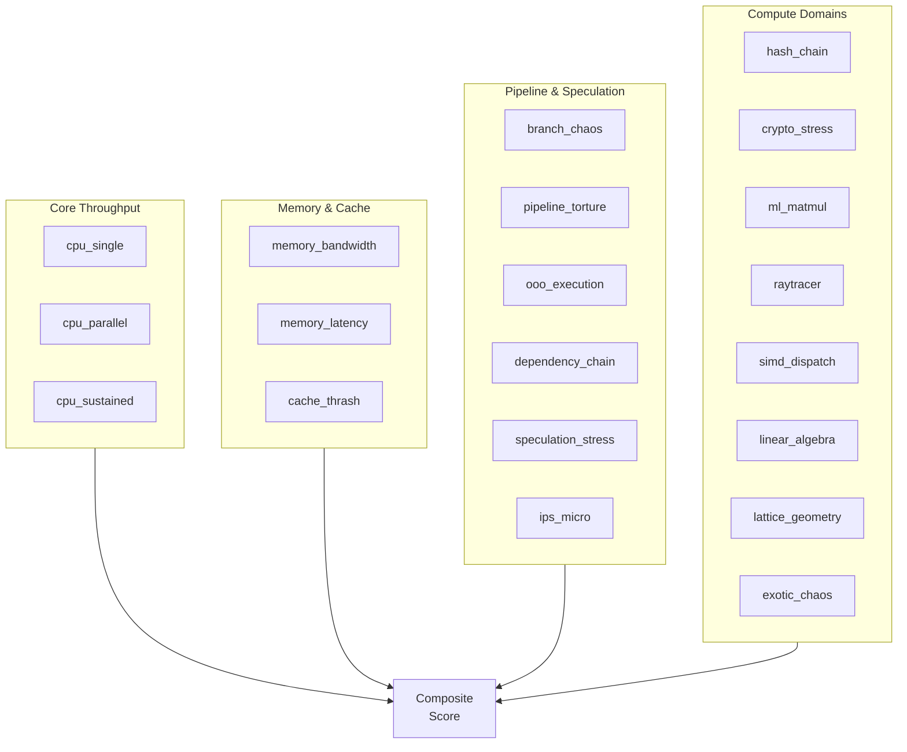

| Module | Detailed description |
|---|---|
| cpu_single | Single-core integer and floating-point throughput on the shared CPU path. |
| cpu_parallel | All-core throughput on the same worker path, used to measure scaling and scheduler behavior. |
| cpu_sustained | Samples throughput every 0.2 seconds across the full run to expose thermal throttling or power limiting. |
| memory_bandwidth | A STREAM-style triad that streams large arrays through read/write operations to measure bandwidth. |
| memory_latency | A shuffled pointer-chasing ring that measures true RAM latency instead of cached throughput. |
| cache_thrash | Separate L1, L2, and L3-sized phases that keep each cache level under pressure. |
| branch_chaos | Deeply nested unpredictable branches and switch dispatch that hammer the branch predictor. |
| hash_chain | A pure-C SHA-256 chain with no OpenSSL or hardware SHA helpers, so crypto acceleration is visible. |
| raytracer | Scalar CPU path tracing against a fixed scene, with no GPU calls or SIMD shortcuts. |
| simd_dispatch | Runs the same math scalar, with SIMD intrinsics, and with compiler auto-vectorization to compare paths. |
| crypto_stress | Exercises AES-128, ChaCha20, RSA modexp, and ECDH-style scalar math to expose crypto acceleration. |
| ml_matmul | Runs FP32 GEMM, INT8 matmul, BF16-style multiply, and attention-like work to detect matrix accelerators. |
| lattice_geometry | Performs NTT, LWE-style matrix-vector work, Babai nearest-plane steps, and Gram-Schmidt orthogonalization. |
| linear_algebra | Benchmarks dense GEMM, LU, Cholesky, power iteration, and conjugate gradient in pure C. |
| exotic_chaos | Randomly mixes ten unrelated algorithms, including Mandelbrot, Game of Life, sort, BFS, and RC4. |
| ips_micro | Measures integer IPS, float IPS, branch behavior, memory latency, TLB pressure, and store-load forwarding. |
| pipeline_torture | Creates ILP bursts, execution-unit contention, and I-cache stress to hit fetch, decode, execute, and retire. |
| ooo_execution | Compares 1, 4, and 16 independent chains, then adds ROB and load/store pressure to reveal OOO width. |
| dependency_chain | Stacks serial integer and FP chains, diamond dependency graphs, memory dependencies, and register pressure. |
| speculation_stress | Mixes predictable and unpredictable branches, BTB stress, deep recursion, and speculative loads. |

### ASIC-Resistant Code

In this repo, ASIC-resistant code means workload patterns that are hard to turn into a narrow special-purpose accelerator. They are not impossible to speed up, but they resist the kind of fixed-function hardware that loves one tiny, regular kernel and struggles with changing control flow, data dependencies, or memory access patterns.

The most ASIC-resistant modules here are the ones with unpredictable branches, pointer chasing, dependency chains, mixed instruction mixes, or changing control flow:

- `branch_chaos`
- `memory_latency`
- `pipeline_torture`
- `ooo_execution`
- `dependency_chain`
- `speculation_stress`
- `exotic_chaos`

By contrast, modules like `hash_chain`, `crypto_stress`, `ml_matmul`, and `simd_dispatch` are intentionally more accelerator-friendly. That is useful too, because if a machine scores strangely high on those workloads, it can reveal hidden hardware help such as AES instructions, matrix engines, or wider SIMD units.

Examples of ASIC-resistant patterns:

```c
/* Hard to prefetch or map to one fixed fast path */
while (bench_now_sec() < deadline) {
    idx = buf[idx];
    idx = buf[idx];
}
```

```c
/* Hard to predict: control flow changes constantly */
uint64_t v = xorshift64(&rng);
if (v & 1) acc += v;
if (v & 2) acc ^= v;
switch ((v >> 13) & 7) {
    case 0: acc += v * 3; break;
    case 1: acc ^= v << 5; break;
    case 2: acc -= v >> 2; break;
    case 3: acc |= v * 7; break;
    case 4: acc &= v + 1; break;
    case 5: acc *= v | 1; break;
    case 6: acc ^= acc >> 11; break;
    case 7: acc += acc << 3; break;
}
```

```c
/* More accelerator-friendly: regular dense math */
for (size_t i = 0; i < n; i++)
    c[i] = a[i] + s * b[i];
```

The last pattern is not bad code; it is just easier to accelerate with SIMD, BLAS, matrix engines, or vendor helpers. This benchmark keeps both kinds of workloads on purpose so you can see the difference clearly.

### The composite score

The **composite score** is the average of all module scores. Because modules measure very different things (memory latency in nanoseconds vs matrix multiply in GFLOPS), the raw numbers vary wildly. The composite is useful for comparing the _same machine over time_ or _similar machines against each other_, but comparing an M2 Mac composite against an Intel desktop composite is apples-to-oranges — look at individual module scores instead.

### How chaining works

Every module receives a `chain_seed` from the previous module's output. It mixes that seed into its workload and produces a `chain_out` that feeds the next module. This creates a cryptographic proof that all modules ran in order — you cannot skip a module or reorder them without breaking the final `chain_proof_hash`.

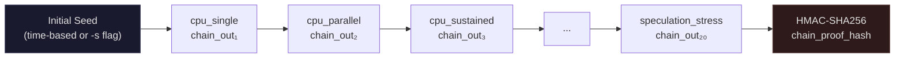

### Anti-cheat detection thresholds

| Detection | Method | Threshold |
|---|---|---|
| Cache pre-seeding | Cold vs warm run ratio | >2× |
| AES-NI | AES vs ChaCha20 speed ratio | >10× |
| SHA-NI | Hashes/sec vs scalar ceiling | >500k/s |
| AMX/BLAS | GEMM GFLOPS vs scalar ceiling | >10 GFLOPS |
| GPU raytracing | Rays/sec vs scalar ceiling | >2M rays/s |
| Thermal throttle | First vs last 3 samples | >15% drop |
| Turbo boost | 1s burst vs 10s sustained | >30% gap |

---

## Viewing the Scoreboard

Open the local HTML dashboard at `docs/torture_benchmark.html` to see your results.

The scoreboard shows:

- **Composite score timeline** — how scores change over time across different machines
- **Selected run module chart** — visual breakdown of strengths and warnings for one run
- **Module comparison bars** — pick any module and compare across all visible runs
- **System spec panel** — CPU, RAM, caches, SIMD flags, source, commit, and config
- **Detailed module table** — score, ops/sec, wall time, flags, and notes for every module
- **Leaderboard** — filter by OS, architecture, verdict, and search text

---

## Customizing Your Run

Set environment variables before running:

```bash
# Run each test for 30 seconds instead of 10 (more accurate, takes longer)
curl -sL https://raw.githubusercontent.com/sunprojectca/torture-bench/main/bench.sh | BENCH_DURATION=30 bash

# Use only 4 threads instead of all cores
curl -sL https://raw.githubusercontent.com/sunprojectca/torture-bench/main/bench.sh | BENCH_THREADS=4 bash

# Clone to a specific directory
curl -sL https://raw.githubusercontent.com/sunprojectca/torture-bench/main/bench.sh | BENCH_DIR=/tmp/mybench bash
```

On Windows PowerShell:

```powershell
$env:BENCH_DURATION = 30
irm https://raw.githubusercontent.com/sunprojectca/torture-bench/main/bench.ps1 | iex
```

---

## For Developers

### Manual build

```bash
git clone https://github.com/sunprojectca/torture-bench.git
cd torture-bench
bash build.sh
```

On Windows with Visual Studio:

```bat
git clone https://github.com/sunprojectca/torture-bench.git
cd torture-bench
mkdir build && cd build
cmake .. -G "Visual Studio 17 2022" -A x64
cmake --build . --config Release
```

On Snapdragon / Qualcomm Windows laptops, use `-A ARM64` instead of `-A x64`.

### Running manually

```bash
# Run the anti-cheat probe first, then full benchmark
./build/tune-probe
./build/torture-bench --tune -d 10 -o results.json --json

# Or choose a custom text report path explicitly
./build/torture-bench --tune -d 10 -o results.json --txt results_report.txt

# Quick 3-second pass
./build/torture-bench -d 3

# Run only one module
./build/torture-bench --only raytracer -d 60

# Skip specific modules
./build/torture-bench --skip raytracer --skip ml_matmul

# Set a deterministic seed for reproducibility
./build/torture-bench -s deadbeefcafebabe
```

### All CLI options

| Option | Argument | Default | Description |
|---|---|---|---|
| `-d` | `<sec>` | `10` | Duration per module |
| `-t` | `<n>` | `0` (all cores) | Thread count |
| `-s` | `<hex>` | time-based | Initial chain seed |
| `-o` | `<file>` | none | Write JSON to file and a matching `.txt` report |
| `--txt` | `<file>` | auto sidecar | Write a detailed human-readable text report |
| `-c` | `<file>` | none | Append CSV row |
| `--tune` | — | off | Run anti-cheat probe first |
| `--verbose` | — | off | Extra output |
| `--list` | — | — | List modules and exit |
| `--only` | `<name>` | — | Run only this module |
| `--skip` | `<name>` | — | Skip this module (repeatable) |
| `--json` | — | off | Print JSON to stdout |

### Platform support

| OS | Architecture | Compiler | Status |
|---|---|---|---|
| Linux | x86_64 | gcc, clang | ✅ |
| Linux | ARM64 | gcc, clang | ✅ |
| WSL2 | x86_64 / ARM64 | gcc, clang | ✅ |
| macOS | ARM64 (Apple Silicon) | clang | ✅ |
| macOS | x86_64 (Intel) | clang | ✅ |
| Windows | x86_64 | MSVC, MinGW, clang | ✅ |
| Windows | ARM64 (Snapdragon) | MSVC | ✅ |

### CI / GitHub Actions

Every push to `main` triggers builds on Linux, macOS, and Windows via GitHub Actions. The static dashboard lives under `docs/`. See `.github/workflows/bench.yml`.

### Adding a new module

1. Create `modules/your_module.c` implementing `bench_result_t module_your_module(uint64_t chain_seed, int thread_count, int duration_sec)`
2. Add the extern declaration in `harness/orchestrator.c`
3. Add to the `MODULE_TABLE` with name + description
4. Add the source file to `CMakeLists.txt`
5. Rebuild and test

---

## Project Structure

```
torture-bench/
├── bench.sh              ← one-liner for Mac/Linux
├── bench.ps1             ← one-liner for Windows
├── CMakeLists.txt        ← cross-platform build config
├── build.sh / build.bat  ← platform build scripts
├── harness/
│   ├── main.c            ← entry point, CLI parsing
│   ├── orchestrator.c/h  ← runs modules in sequence
│   ├── reporter.c/h      ← JSON + CSV output
│   ├── platform.c/h      ← OS/CPU/SIMD detection
│   ├── common.h          ← shared types + timing
│   └── bench_thread.h    ← portable threading (pthreads / Win32)
├── modules/
│   ├── cpu_single.c      ← single-core torture
│   ├── cpu_parallel.c    ← all-core parallel
│   ├── ... (20 modules)
│   └── anticache_guard.c ← cache flush / anti-cheat
├── tools/
│   └── tune_probe.c      ← standalone anti-cheat diagnostics
├── results/              ← benchmark JSON/CSV outputs
├── docs/
│   ├── index.html        ← redirect to the canonical dashboard entrypoint
│   ├── torture_benchmark.html ← canonical static dashboard
│   └── data/             ← fallback snapshot data + raw published runs
└── .github/workflows/
    └── bench.yml         ← CI: build + smoke test
```

---

# The Philosophy: Why This Benchmark Exists and How It Thinks

Everything above this line is about running the tool. Everything below is about why the tool was built this way, what is wrong with the alternatives, and why it matters when benchmark numbers become decision-making inputs.

If you are an engineer who has ever been handed a benchmark chart in a meeting and told to make a purchasing decision based on it, this section is for you.

---

## Why torture-bench Exists

torture-bench exists because benchmark charts and real work did not line up on my own hardware.

Over time I ended up testing a wide spread of machines: FPGA boards, Raspberry Pis, mini PCs, laptops, gaming desktops, workstations, custom-built systems, and even a quad-Xeon Dell rack server with around 1.2 TB of RAM. After enough real use, a pattern became hard to ignore: polished benchmark scores often did not match what these systems actually did on open-source tasks, compiles, scripting, data processing, CPU-heavy utilities, local AI experiments, and general day-to-day responsiveness.

Some machines looked amazing in popular benchmark results and then felt underwhelming once the work became long-running, irregular, branch-heavy, memory-sensitive, or less idealized. Other machines that looked weaker on paper kept performing better than expected when the task stopped being a clean synthetic demo and started behaving more like real software.

That mismatch is the reason this project exists.

This was not built to generate one more marketing number. It was built because I wanted a benchmark that explains *why* a system behaves the way it does, not just one that hands me a score and tells me to trust it.

### The mismatch, visualized

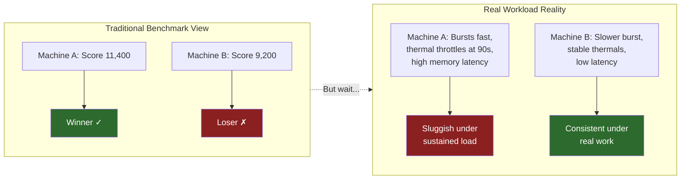

If you have ever bought or specced a machine based on a benchmark score, then deployed it and thought *"this doesn't feel as fast as it's supposed to be"* — that is the problem torture-bench was built to diagnose.

---

## The Logical Fallacies of Modern Benchmarking

Before getting into the technical architecture, it is worth naming the reasoning errors that make bad benchmarks so persistent. These are not obscure academic issues. They are the specific ways that benchmark numbers become lies in practice — especially when those numbers drive purchasing decisions, architecture reviews, or infrastructure planning.

If you make decisions with data, you need to know when the data is lying to you.

### Fallacy 1: Appeal to Authority (*Argumentum ad Verecundiam*)

> *"[Popular benchmark] says Machine A scores 14,200 and Machine B scores 11,800. Machine A is better."*

The score came from a reputable tool, so it must be correct. But "correct" and "useful" are not synonyms. The score may be arithmetically accurate while being architecturally meaningless for your workload.

**Tech example — misleading:** A cloud team evaluates two instance types for a Redis-backed inference pipeline. Instance A scores 15% higher on a popular single-number benchmark. They deploy on Instance A. Throughput is worse. Why? The benchmark was dominated by AVX-512 dense math. The pipeline is dominated by random key lookups (pointer-chasing latency) and unpredictable branching in the inference graph. The benchmark measured the wrong dimension entirely.

**Tech example — honest:** The team runs torture-bench on both instances. Instance A dominates `ml_matmul` and `simd_dispatch`. Instance B dominates `memory_latency` and `branch_chaos`. The module breakdown makes it obvious which instance fits a Redis workload. No single number. A profile.

**The relatable version:** This is like choosing a car based solely on its top speed, then being surprised it is terrible in stop-and-go traffic. Top speed is a real number. It just has nothing to do with your commute.

### Fallacy 2: Survivorship Bias

> *"Every top-ranked machine on the leaderboard uses Architecture X. Architecture X must be best."*

What you do not see: the machines running Architecture X that scored poorly and never got submitted, the configurations that were quietly discarded, the vendor-tuned builds that do not represent what a customer actually deploys. Leaderboards are curated by the people who submit to them.

**Tech example:** A vendor runs their chip through 50 benchmark configurations. Three of those produce chart-topping numbers. The other 47 are quietly discarded. The three winning configurations use a specific compiler with specific flags on a specific OS version with a specific memory configuration. The customer gets the chip, runs stock gcc with `-O2`, and sees none of those numbers.

**The relatable version:** This is like concluding that all successful companies use Kubernetes because every tech talk you see at conferences is about Kubernetes. Nobody gives a conference talk titled "We Tried Kubernetes and Went Back to VMs."

### Fallacy 3: Composition Fallacy (The Single-Number Trap)

> *"This CPU got the highest composite score, so it is the best CPU."*

A composite score is a weighted average. Averages destroy information. A CPU that is exceptional at dense math and terrible at memory latency can produce the same composite as a CPU that is mediocre at both. The composite looks identical. The real-world behavior is completely different.

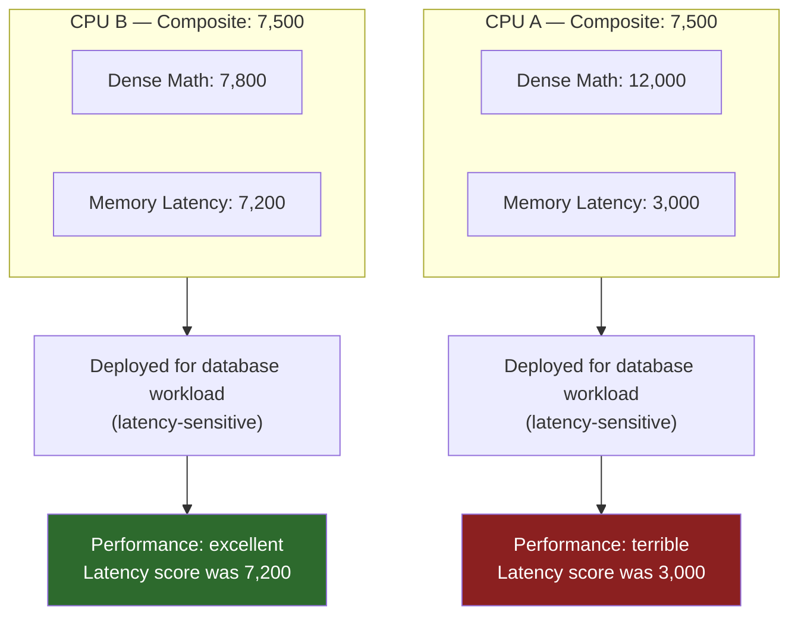

**The relatable version:** Your GPA is 3.5. That could mean you got straight B+'s, or it could mean you got A+'s in every class except the one that matters for your job, where you got a D. The GPA hides the one number that matters most.

### Fallacy 4: Hasty Generalization (Small Sample, Big Claim)

> *"I ran the benchmark once and Machine A scored higher. Machine A is faster."*

One run captures one thermal state, one background process mix, one OS scheduler decision, one turbo boost window. Variance matters. A machine that scores 10,200 on one run and 8,400 on the next is not the same as a machine that scores 9,300 on every run.

**Tech example — misleading:** Run the benchmark immediately after boot when turbo boost is available and thermal headroom is maximum. Score: 11,800. Put that number in the slide deck. Never run it again.

**Tech example — honest:** Run the benchmark three times. First run: 11,800 (cold start, turbo boost). Second run: 9,400 (warmed up, turbo budget spent). Third run: 9,500 (sustained). The real sustained performance is 9,450. The first run was a 25% lie.

This is exactly what the `cpu_sustained` module measures: it samples throughput every 0.2 seconds across the entire run, so you can see whether the chip holds its speed or quietly drops.

### Fallacy 5: Texas Sharpshooter (Draw the Target After Shooting)

> *"Our chip scored 38% higher than the competition." (footnote: on a single sub-test, at a specific power state, with a specific compiler, on a specific version of the benchmark)*

The data is real. The framing is a lie. You drew the target around the bullet hole. This is endemic in marketing materials, especially when a new architecture launches and the vendor picks the one metric that looks best.

**The relatable version:** "Our restaurant has the best reviews in the city!" (based on reviews from the owner's family, filtered to only show 5-star ratings, during the one week the head chef was actually in the kitchen)

### Fallacy 6: False Equivalence

> *"Both benchmarks measure 'CPU performance,' so their scores are comparable."*

If Benchmark X measures dense AVX-512 throughput and Benchmark Y measures branch-heavy scalar code, their scores live in different universes. Comparing them is like comparing a car's 0–60 time with its towing capacity and concluding one number is "better."

**Tech example:** Someone posts "Machine A scores 14,200 on Benchmark X and 8,900 on Benchmark Y — what a huge regression!" There is no regression. Benchmark X is 90% SIMD-vectorized floating-point loops. Benchmark Y is 60% random branching and pointer-chasing. They are measuring completely different CPU capabilities. The scores are unrelated numbers that happen to share the word "benchmark."

### Fallacy 7: Anchoring Bias (The First Number Wins)

> *"[Popular benchmark] says 14,000. Everything else is just details."*

Once a number is in your head, all subsequent information gets interpreted relative to it. If the first benchmark you see says Machine A is 20% faster, you will unconsciously require overwhelming evidence to change your mind — even if the 20% came from a workload that has nothing to do with yours.

**Tech example — the procurement meeting:** The VP already saw a chart showing Vendor A is 20% faster. Now you show up with module-level data showing Vendor B has 2x better memory latency for the actual workload. The VP says "but it's 20% slower overall." That "overall" number was an average of 30 tests, 28 of which are irrelevant to the deployment. The anchor won. The data lost.

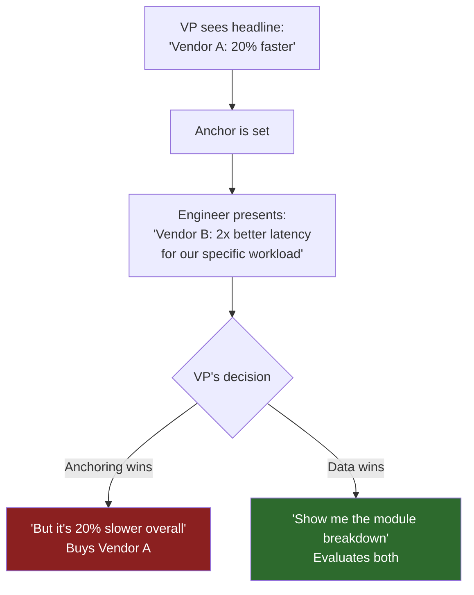

---

## Why One-Number Benchmarks Are Not Enough

A single score is useful for engagement and quick ranking, but it is weak as a technical explanation.

Real CPUs do not do one kind of work. They deal with:
- single-thread execution
- multi-thread scaling
- memory bandwidth
- memory latency
- cache pressure
- branch prediction
- dependency chains
- speculation failures
- execution pipeline pressure
- sustained thermal and power behavior
- regular workloads
- ugly, irregular workloads

Collapsing all of that into one polished number hides the machine instead of revealing it.

A system can have excellent bandwidth and mediocre latency. It can burst hard for two seconds and then throttle. It can dominate in dense regular math and look much less impressive once the workload becomes unpredictable. It can scale beautifully across cores but still feel mediocre in latency-sensitive software. Those are not side notes. They are often the whole story.

That is why torture-bench is multi-module. The module breakdown is the real result. The composite score is only a summary sitting on top of visible evidence. The modules explain the score. Without them, the score is just a label.

### The dashboard view vs. the blood panel view

Think of it this way. If a doctor handed you a single number — "your health score is 74" — and told you to make medical decisions based on it, you would be right to be suspicious. You would want blood pressure, cholesterol, liver function, heart rate, respiratory rate, glucose, and the actual test data behind each one. A single "health score" is marketing. The panel of individual readings is medicine.

torture-bench treats CPU measurement the same way. The composite is the headline. The module breakdown is the actual chart.

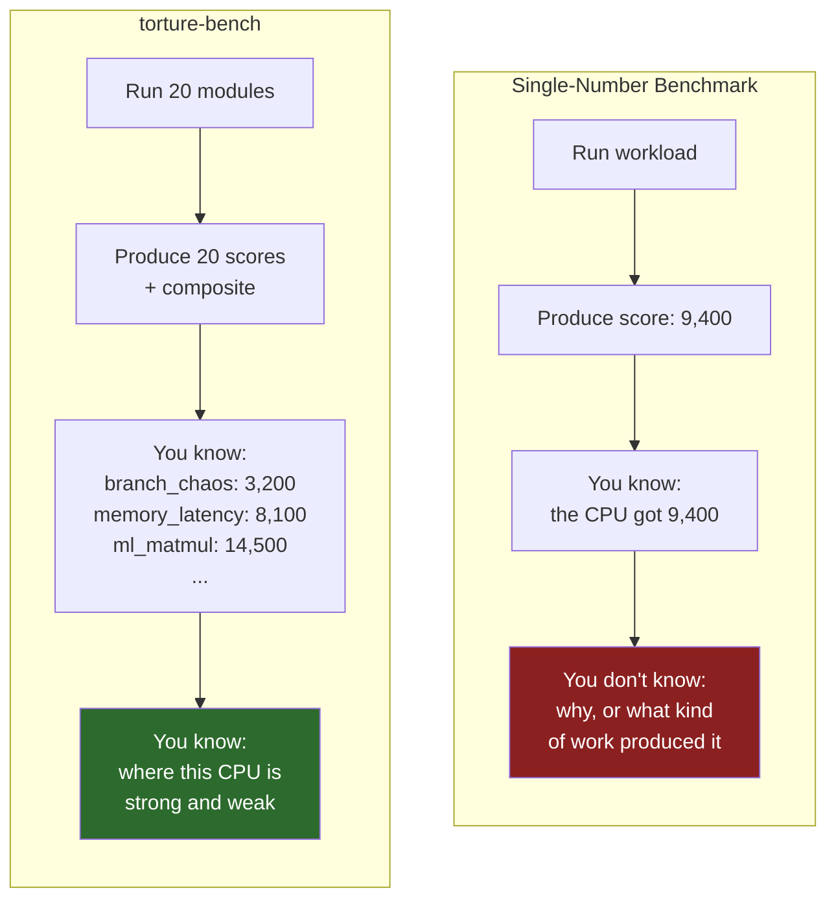

---

## Why Closed-Source Benchmarks Create a Trust Problem

If a benchmark is closed-source, the public cannot fully verify:
- what is actually being tested
- how the score is produced
- whether certain paths favor one platform or compiler
- whether hidden acceleration is involved
- whether the workload changed between versions
- whether the final score reflects CPU work, assisted work, or a mixture

Even when a closed benchmark is made in good faith, it still depends on trust rather than inspection.

Open source does not automatically make a benchmark perfect, but it makes it challengeable, inspectable, and improvable. People can read the code, question assumptions, rebuild it, compare binaries, and argue over design decisions in the open. That is a much better foundation for something that claims to measure hardware honestly.

Source visibility matters even more because source alone is not the whole truth. The same source code can produce very different binaries depending on compiler version, architecture target, flags, vectorization behavior, runtime dispatch, and linked libraries. So the right standard is not just open source, but open source plus visible build assumptions and visible workload structure.

### A concrete example of why this matters

Consider two compilers building the same loop:

```c
// Simple reduction loop — same source, different binaries
double sum = 0.0;
for (int i = 0; i < N; i++) {
    sum += data[i];
}
```

**Compiler A** (`gcc -O2 -march=native` on Zen 4): Emits AVX-512 `vaddpd` with 8-wide vectors and loop unrolling. Processes 8 doubles per cycle.

**Compiler B** (`clang -O2` with no `-march`): Emits SSE2 `addsd`, processing 1 double per cycle.

Same source code. Same "benchmark." One binary is 6–8× faster on the same hardware — not because the CPU changed, but because the compiler did. If the benchmark is closed-source, you cannot even ask this question.

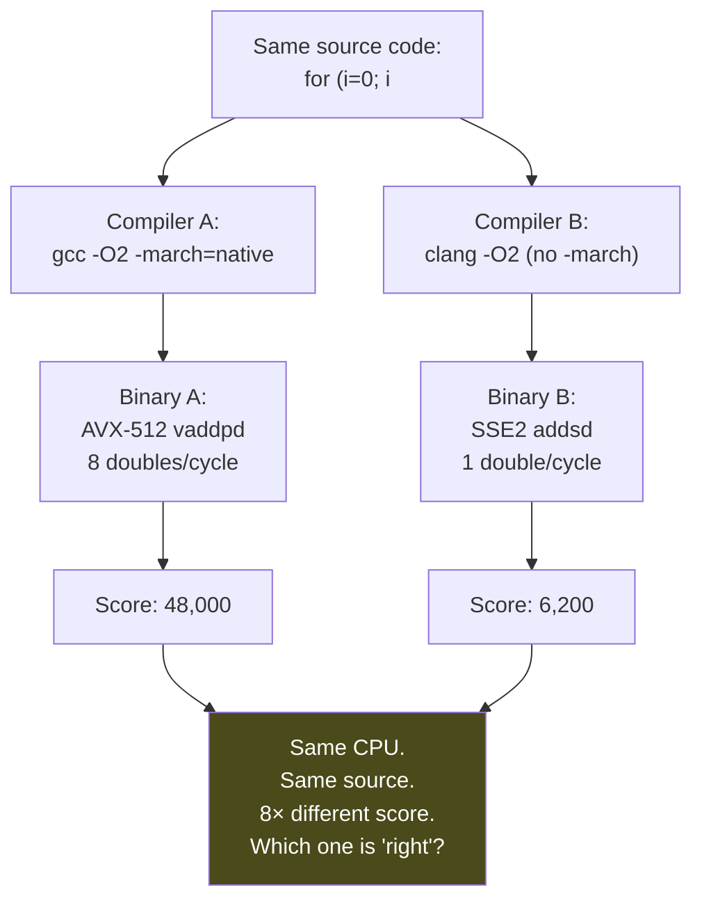

If the benchmark is closed-source, you do not know which compiler path produced the number. You cannot ask. You cannot reproduce. You can only trust. That is a weak foundation for a decision-making tool.

---

## Why Randomness Matters in Benchmarking

Predictable workloads are easy to flatter.

Modern CPUs, compilers, prefetchers, branch predictors, and various helper paths are all better when the work is regular, repetitive, and easy to anticipate. That is not cheating by itself. It is simply how modern systems are built. But if a benchmark becomes too neat and too predictable, it stops measuring general-purpose CPU quality and starts measuring how perfectly the system can rehearse one narrow pattern.

That is where randomness matters.

Randomness in a benchmark is useful when it helps break perfect rhythm and forces the system to deal with less ideal conditions. It helps in several ways:

### It weakens perfect branch prediction
If control flow is always tidy and repetitive, the branch predictor learns it and the benchmark turns into a practiced routine. Real software is often messier than that. Randomized decision paths help show how the CPU behaves when it cannot live off perfect guesses.

### It weakens perfect prefetch behavior
Regular memory strides are easy to prefetch. Dependent pointer chasing and shuffled access patterns are much harder. That matters because many real workloads are not clean streams. Object graphs, databases, parsers, compilers, interpreters, allocators, and system software often behave more like a maze than a highway.

### It resists narrow over-optimization
A tiny, fixed, repeated kernel invites specialization. Mixed and randomized patterns make it harder for the benchmark to accidentally reward one narrow strength as if it were universal performance.

### It reveals general-purpose behavior
The more the workload changes shape, the more it tests the CPU as a CPU, instead of as a vehicle for one carefully staged demo.

That is one reason this suite includes irregular and hostile patterns alongside regular and friendly ones.

### Code example: predictable vs. unpredictable branching

This is what a benchmark-friendly loop looks like:

```c
// PREDICTABLE: branch predictor learns this in ~10 iterations
// After warmup, this runs at near-zero branch miss rate
for (int i = 0; i < N; i++) {
    if (data[i] > threshold) {  // always true or always false for sorted data
        sum += data[i];
    }
}
```

This is what real software often looks like:

```c
// UNPREDICTABLE: branch predictor cannot learn this
// ~50% miss rate, pipeline flushes on every miss
for (int i = 0; i < N; i++) {
    if (data[i] > threshold) {  // data is random, so direction is random
        sum += data[i];
    } else {
        sum -= data[i] >> 1;
    }
}
```

On a modern out-of-order CPU, the predictable version might run 3–5× faster than the unpredictable version — on the same hardware, with the same instruction count. The difference is entirely in branch prediction success rate. A benchmark that only tests the first pattern flatters the CPU. A benchmark that tests both tells the truth.

```mermaid
flowchart TD
    subgraph Predictable["Sorted Data — Predictable"]
        P1["Branch: taken"] --> P2["Branch: taken"]
        P2 --> P3["Branch: taken"]
        P3 --> P4["Branch: taken"]
        P4 --> P5["Predictor: 99.9% accuracy\nPipeline: smooth"]
    end

    subgraph Unpredictable["Random Data — Unpredictable"]
        U1["Branch: taken"] --> U2["Branch: NOT taken"]
        U2 --> U3["Branch: taken"]
        U3 --> U4["Branch: NOT taken"]
        U4 --> U5["Predictor: ~50% accuracy\nPipeline: constant flushes"]
    end

    style P5 fill:#2d6a2d,color:#fff
    style U5 fill:#8b2020,color:#fff
```

---

## Why Mixing Algorithms Matters

A benchmark built around only one workload family will tend to favor machines that are good at that family.

If the entire suite is made of dense matrix math, regular streaming loops, and highly structured compute kernels, then the result will mostly describe how well the system handles that style of work. That is useful information, but it is not the same thing as broad CPU quality.

Real software is mixed. A compiler is not one algorithm. A browser is not one algorithm. A database is not one algorithm. A scripting runtime is not one algorithm. A build process, local toolchain, or CPU-heavy utility is not one algorithm. Real systems keep switching between:
- arithmetic
- memory movement
- pointer chasing
- branching
- scheduling
- cache reuse
- irregular state transitions
- repeated kernels
- ugly fallback paths

That is why torture-bench mixes modules instead of pretending that one kernel family tells the whole truth.

The suite intentionally contains both:
- **friendly patterns**, such as regular dense math or streaming access, because those workloads are real and should be measured
- **hostile patterns**, such as branch chaos, dependency chains, speculation stress, and pointer chasing, because those are also real and often much closer to how software actually behaves

A useful benchmark needs both.

### An analogy most people have lived

If you only test a car on a flat, dry highway at 70 mph, it will look great. But if your actual driving includes hills, rain, stop signs, gravel roads, and parking garages, that highway test told you very little about your real experience. The highway number is not fake. It is just one dimension of a multi-dimensional reality.

CPUs work the same way. Dense math is the highway. Pointer chasing in a database's B-tree is the gravel road. Branch-heavy parsing of a config file is the stop-and-go traffic. You need all of them.

---

## Why Unpredictability Matters

A machine looks best when it knows what is coming.

Predictable work lets the system settle into an ideal path. Branch predictors guess better. Prefetchers get ahead. Vector units stay fed. Compiler simplifications line up neatly. The pipeline stays smoother. But real programs often do not grant that luxury.

Unpredictability matters because it forces the system to handle:
- changing control flow
- branch misses
- unstable dependency patterns
- less useful prefetching
- front-end disruption
- speculative mistakes
- less elegant memory access

That is why unpredictability is not noise in this benchmark design. It is part of the point.

---

## Why Matching Core Counts Can Matter

Raw all-core results are useful, but they can blur important differences.

If one machine has more active cores or threads, then a straight all-threads run may say more about quantity of parallel resources than about per-core quality, scaling efficiency, or architectural behavior. That is why serious comparison work often benefits from two views:

### Native maximum mode
Let the system use its natural full thread count. This shows what the machine delivers as configured.

### Matched-core mode
Constrain systems to the same active thread or core count where possible. This makes it easier to study per-core behavior, scheduler quality, and scaling efficiency without letting thread count dominate the whole story.

Both views are valid. They answer different questions. The important thing is to know which question a result is answering.

```bash
# Native maximum: use all cores
./build/torture-bench --tune -d 10 -o results_full.json --json

# Matched-core: constrain to 8 threads for fair comparison
./build/torture-bench --tune -d 10 -t 8 -o results_8t.json --json
```

**Tech example — misleading:** A 64-thread server beats a 16-thread workstation in an all-core benchmark. Conclusion: "the server CPU is better." Reality: per-core, the workstation is 40% faster. The server won on thread count, not architecture. For a single-threaded build step that takes 45 minutes, the workstation finishes in 27 minutes and the server takes 45.

**Tech example — honest:** Run both machines at `-t 16`. Now you see per-core quality, scheduling efficiency, cache contention, and NUMA behavior on equal footing. The server's score drops because its per-core clocks are lower. The workstation's score stays flat. The matched-core run reveals the truth that the all-core run obscured.

---

## What Latency Is, and Why Memory Speed Can Still Be Useless

People often talk about memory speed as if it settles the issue by itself. It does not.

There are at least two separate realities in memory performance:

### Bandwidth
How much data can be moved per unit time.

### Latency
How long it takes for the CPU to get the next piece of data when it actually needs it.

Bandwidth is the width of the pipe.
Latency is the waiting time before the next needed value arrives.

A system can have excellent memory bandwidth and still perform poorly on latency-sensitive workloads. That happens when the next step depends on the result of the previous memory fetch. In that case, the CPU cannot simply stream harder or use more bandwidth to escape the problem. It has to wait for the exact answer before it even knows what to ask for next.

That is why patterns like dependent pointer chasing matter so much. A loop such as:

```c
while (bench_now_sec() < deadline) {
    idx = buf[idx];
    idx = buf[idx];
}
```

is useful because each access depends on the result of the last one. The CPU cannot just run ahead on bandwidth. It must wait on real latency.

That is also why impressive memory transfer numbers can become almost meaningless for certain workloads. If the workload is dependency-bound and pointer-heavy, raw speed on paper does not save you. The real limit becomes how fast the next dependent access resolves.

### The water pipe analogy

Bandwidth is the diameter of your water pipe. Latency is how long it takes from when you turn the faucet until water comes out.

If you are filling a swimming pool (streaming workload), pipe diameter dominates. A bigger pipe fills faster.

If you are a chef who needs one cup of water, waits for the recipe to tell you what to do next, then needs another cup — the pipe diameter is irrelevant. What matters is how fast water appears after you turn the handle. That delay is latency, and no amount of pipe diameter fixes it.

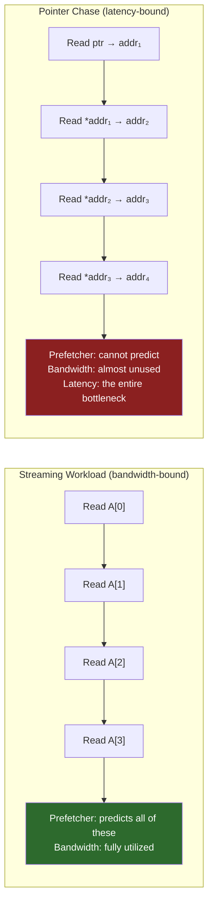

### Why this destroys database and Redis benchmarks

This is not theoretical. Redis, memcached, LevelDB, and any B-tree or hash-table workload live in pointer-chase territory. Every key lookup follows a chain of pointers through memory. The CPU cannot predict the next address because it depends on the data at the current address. DDR5-6400 bandwidth means nothing here. What matters is CAS latency, memory controller queue depth, and how fast a single dependent load resolves.

A machine with DDR5-4800 and tighter timings can outperform a machine with DDR5-6400 and loose timings on every Redis operation. The spec sheet says the second machine has "faster memory." The workload disagrees.

---

## What Pipelining Is

Modern CPUs do not complete one instruction entirely before beginning the next one. That would waste too much time.

Instead, they overlap stages of work. A rough mental model looks like this:

1. fetch instruction
2. decode instruction
3. prepare data and operands
4. execute
5. access memory if needed
6. retire the result

Different instructions can be at different stages at the same time. That overlap is pipelining.

Pipelining is a big reason modern CPUs are fast, but it is also fragile. If the CPU predicts the wrong path, or if needed data arrives late, parts of the pipeline stall or get thrown away. That is why a CPU can look extremely strong on clean regular code and much less impressive on code that causes mispredictions, dependency stalls, or memory delays.

Modules that stress the pipeline matter because they show whether the CPU can keep its internal machinery fed and productive, or whether it keeps wasting work through flushes, stalls, and contention.

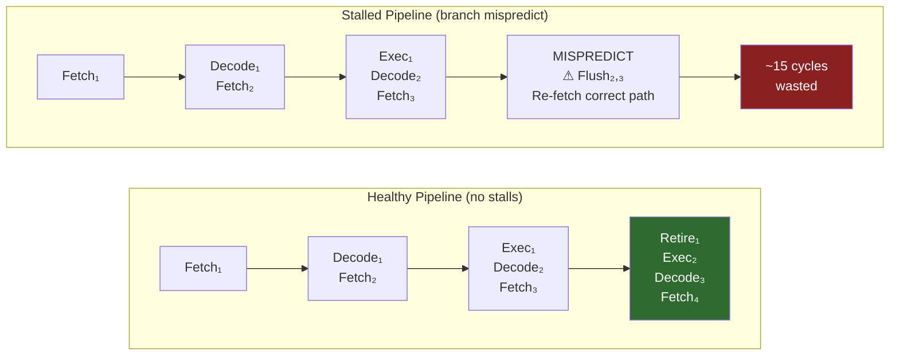

### The assembly line analogy

A CPU pipeline is an assembly line. Station 1 fetches the part. Station 2 prepares it. Station 3 welds it. Station 4 inspects it. Station 5 ships it. When everything flows, you get one finished product per cycle even though each product takes five stations to complete.

Now imagine Station 3 welds the wrong part (branch mispredict). You have to pull everything off stations 3, 4, and 5, throw it away, and start over. That is a pipeline flush. The assembly line was running at full speed and producing garbage. The cost is not just the wasted parts — it is the time the line sat idle while resetting.

That is why `pipeline_torture` and `speculation_stress` exist as modules. They test whether the assembly line handles surprises gracefully or collapses into constant rework.

---

## What Branches Are, and Why They Hurt

A branch is a decision point in code:

* if this, do one thing
* otherwise, do another
* switch on a value
* repeat or stop a loop

Branches are everywhere. Business logic, parsers, compilers, protocol handlers, interpreters, games, browsers, and OS code branch constantly.

The CPU wants to keep moving, so it predicts which way a branch will go before it knows for sure. If it guesses correctly, the machine keeps flowing. If it guesses wrong, some of the work already in flight becomes wasted and must be corrected.

That is why branch-heavy and unpredictable code is such a useful benchmark ingredient. It tests whether the CPU survives uncertainty well, rather than looking good only when every path is obvious in advance.

A benchmark with no branch pain is too polite to the hardware.

### Real-world branch density

To put this in perspective, here are approximate branch frequencies in real software:

| Software | Branches per 1000 instructions | Predictability |
|---|---|---|
| BLAS / dense math kernels | ~2–5 | Very high (loops are tight and regular) |
| Video encoder (x264) | ~100–150 | Moderate (some data-dependent paths) |
| Python interpreter (CPython) | ~200–300 | Low (opcode dispatch is essentially random) |
| JavaScript JIT (V8) | ~150–250 | Low-moderate (dynamic types, polymorphism) |
| GCC compilation | ~150–200 | Low (AST traversal, optimization passes) |
| Redis request handling | ~100–200 | Low-moderate (command dispatch, key types) |

A benchmark that avoids branches is testing a workload that almost no real software resembles. The only programs with near-zero branch density are hand-tuned SIMD kernels — which represent a tiny fraction of the code that actually runs on a general-purpose CPU.

---

## The Anatomy of a Misleading Benchmark (Code Walkthrough)

This section shows actual code patterns — one misleading, one honest — so you can see concretely how benchmarks lie.

### The misleading version

```c
// benchmark_misleading.c
// This benchmark will produce impressive numbers that mean almost nothing.

#include <stdio.h>
#include <time.h>

#define N (1 << 20)  // 1 million elements — fits entirely in L2/L3 cache
static double data[N];

void setup() {
    // Fill with SORTED data — branch predictor will learn the pattern instantly
    for (int i = 0; i < N; i++)
        data[i] = (double)i;
}

double run_benchmark() {
    double sum = 0.0;
    // The ENTIRE working set fits in cache after the first pass.
    // Every subsequent pass is a cache-hot, prefetcher-friendly,
    // branch-predictor-friendly, vectorization-friendly dream.
    for (int pass = 0; pass < 1000; pass++) {
        for (int i = 0; i < N; i++) {
            if (data[i] > 0.0)      // always true (sorted positive) — predictor: 100%
                sum += data[i];      // sequential access — prefetcher: perfect
        }
    }
    return sum;  // prevent dead code elimination
}

int main() {
    setup();
    clock_t start = clock();
    double result = run_benchmark();
    clock_t end = clock();
    double seconds = (double)(end - start) / CLOCKS_PER_SEC;
    printf("Score: %.0f billion ops/sec\n", (N * 1000.0) / seconds / 1e9);
    printf("(result=%f)\n", result);
    return 0;
}
```

**Why this is misleading — a checklist of sins:**

| Sin | What it does | Why it flatters the CPU |
|---|---|---|
| Small working set (8 MB) | Fits in L2/L3 cache | Measures cache speed, not memory speed |
| Sorted data | Branch always taken | Predictor achieves 99.99% accuracy |
| Sequential access | `data[0], data[1], data[2]...` | Hardware prefetcher predicts every load |
| Simple loop body | One compare, one add | Compiler auto-vectorizes with AVX/NEON |
| 1000 identical passes | Same pattern repeated | CPU "practices" the workload |

This code will produce a massive ops/sec number. That number is real. It is also useless as a measure of general CPU quality because it tests the CPU only in its most idealized, comfortable operating mode.

### Why this matters for decision-making

If you are comparing two CPUs using this benchmark, the one with a larger L2 cache or a better prefetcher will win — not because it is a better CPU in general, but because this specific workload was designed (accidentally or intentionally) to reward those specific features. Deploy either CPU on a workload with random memory access patterns and the ranking may reverse completely.

---

## How Honest Benchmarks Differ (Code Walkthrough)

```c
// benchmark_honest.c
// This benchmark is harder to flatter.

#include <stdio.h>
#include <stdlib.h>
#include <time.h>

#define N (1 << 24)  // 16 million — exceeds most L3 caches
static uint32_t data[N];

void setup() {
    // Shuffled pointer-chase ring — defeats prefetcher
    for (uint32_t i = 0; i < N; i++) data[i] = i;
    // Fisher-Yates shuffle
    for (uint32_t i = N - 1; i > 0; i--) {
        uint32_t j = rand() % (i + 1);
        uint32_t tmp = data[i]; data[i] = data[j]; data[j] = tmp;
    }
}

uint64_t run_benchmark() {
    uint64_t acc = 0;
    uint32_t idx = 0;

    // Each access depends on the previous one (serial dependency chain).
    // The prefetcher cannot predict the next address.
    // The branch predictor has nothing useful to learn.
    // This measures REAL memory latency, not bandwidth.
    for (int i = 0; i < N * 4; i++) {
        idx = data[idx % N];
        // Unpredictable branch — ~50% taken
        if (idx & 1)
            acc += idx;
        else
            acc ^= idx;
    }
    return acc;
}

int main() {
    setup();
    clock_t start = clock();
    uint64_t result = run_benchmark();
    clock_t end = clock();
    double seconds = (double)(end - start) / CLOCKS_PER_SEC;
    printf("Score: %.2f M traversals/sec\n", (N * 4.0) / seconds / 1e6);
    printf("(result=%lu)\n", (unsigned long)result);
    return 0;
}
```

**Why this is honest — a checklist of virtues:**

| Virtue | What it does | Why it reveals the CPU |
|---|---|---|
| Large working set (64 MB) | Exceeds L3 cache | Forces real DRAM access |
| Shuffled data | Random pointer chase | Prefetcher cannot help |
| Serial dependency | Each load depends on previous | No instruction-level parallelism |
| Unpredictable branch | `if (idx & 1)` on random data | ~50% miss rate, constant flushes |
| No vectorization opportunity | Scalar pointer chase | SIMD width is irrelevant |

The score from this version will be dramatically lower. That is the point. It is measuring a dimension that the misleading version hides entirely.

---

## When Benchmarks Become Decision-Making Tools: The Real Danger

The problems described above are not just intellectual curiosities. They cause real engineering and business damage when benchmark numbers flow into decision-making processes.

### Scenario 1: Server procurement

An infrastructure team needs to buy 200 servers for a new Redis cluster. Vendor A shows a benchmark where their chip scores 18% higher than Vendor B. The team buys Vendor A. Six months later, p99 latency is 40% worse than projected. Why? The benchmark tested streaming bandwidth. Redis is dominated by random key access and pointer chasing — latency-bound, not bandwidth-bound. The benchmark measured the wrong axis. The purchasing decision was based on a number that had no relationship to the actual workload.

**Cost:** millions of dollars in hardware that underperforms, plus the engineering time to diagnose and mitigate.

### Scenario 2: Architecture review

A startup chooses ARM-based instances because a benchmark shows 30% better performance-per-watt. Their main workload is a C++ compiler toolchain — branch-heavy, irregular, scalar-dominated. The ARM chip's wide SIMD units and efficient dense-math pipeline provide zero benefit. The x86 chip's stronger branch predictor and deeper speculation window would have been faster for this specific workload. The benchmark told a true story about dense math. The startup deployed a compiler.

### Scenario 3: Performance regression investigation

A team sees a 12% drop in their benchmark score after a kernel update. They spend two weeks investigating. The actual cause: the kernel changed its timer implementation, and the benchmark's timing function now has slightly different overhead. Application performance is unchanged. The benchmark measured its own timing infrastructure, not the CPU.

### Scenario 4: The developer laptop debate

Engineering wants MacBook Pros. Finance wants cheaper Windows laptops. Both sides cite benchmarks. The Mac benchmark emphasizes single-thread and sustained performance (compile times). The Windows benchmark emphasizes multi-thread burst (parallel test suites). Both benchmarks are correct for their chosen dimension. Neither side realizes they are arguing about different axes. The debate takes three months. Everyone is frustrated. The benchmark numbers made the argument worse, not better, because they collapsed a multi-dimensional question into a single-axis fight.

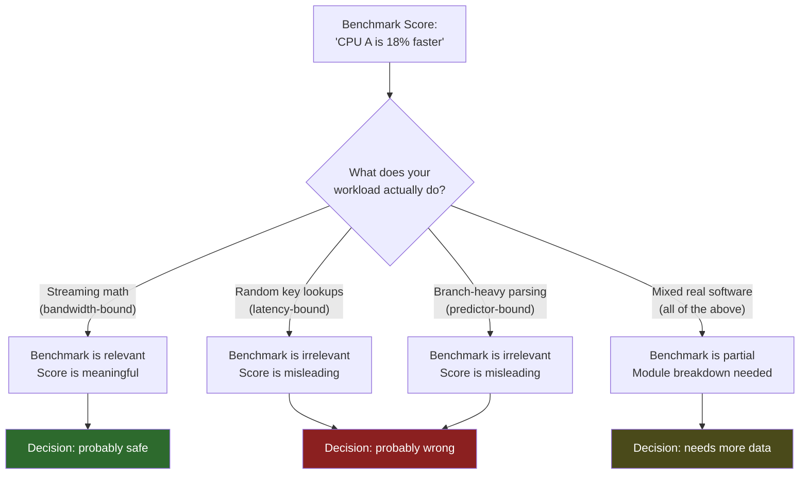

### The core problem

A benchmark becomes dangerous when it is treated as a decision-making tool but does not measure the dimensions relevant to the decision. This is not the benchmark's fault if it never claimed to be universal. It becomes a systemic problem when:

1. The benchmark produces a single number
2. That number is easy to compare
3. People compare it
4. Nobody asks what the number actually measured
5. Purchasing, architecture, and staffing decisions follow

torture-bench cannot prevent all of this, but it can make the module breakdown visible so that step 4 becomes harder to skip.

---

## Why a Good CPU Benchmark Needs Both Friendly and Hostile Patterns

Some workloads are naturally friendly to modern hardware:

* regular streaming loops
* dense math
* vector-heavy arithmetic
* structured kernels
* workloads with dedicated instruction support

Other workloads are hostile:

* pointer chasing
* irregular branches
* serial dependency chains
* speculation stress
* mixed chaotic kernels
* changing control flow

A benchmark that only includes friendly patterns becomes too easy to flatter.
A benchmark that only includes hostile patterns becomes too narrow in the opposite direction.

The right answer is balance.

That is why this suite includes both accelerator-friendly modules and harder-to-fake modules. The first group measures real strengths. The second group prevents the benchmark from turning into a contest of idealized fast paths.

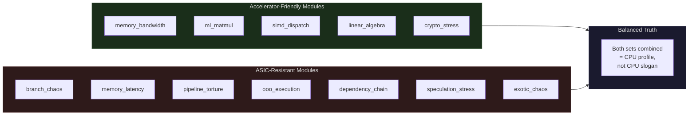

---

## Why This Benchmark Is Beta

This project is still beta.

That is not a disclaimer meant to lower the standard. It is a warning that CPU study is deep, and that better versions should come from studying more systems, more anomalies, and more edge cases.

The more hardware you test, the more weird behavior you find:

* compilers doing unexpected things
* score shapes that look wrong until you inspect the module mix
* systems that burst well and sustain poorly
* modules that reveal hidden bias only after wider testing
* workloads that need rebalancing
* reporting that can be made clearer
* anomalies that force better detection logic

That is exactly why future versions should improve. Better benchmarking comes from more observation, more skepticism, and more visible reasoning.

The goal is not to claim final perfection. The goal is to keep making the benchmark more honest, more interpretable, and more useful as more CPUs are studied.

---

## Why I Made This for Myself First

This project started as a personal measurement problem.

I kept seeing benchmark results that did not match what I was observing on my own hardware and in my own workloads. After enough inconsistencies, the problem stopped looking like random noise and started looking like bad measurement.

So I built the benchmark I wanted to have:

* open
* inspectable
* multi-module
* suspicious of sealed scores
* interested in module breakdowns instead of magic numbers
* interested in sustained behavior
* interested in unpredictable and irregular workloads
* interested in separating broad CPU behavior from overly idealized cases

This was built for my own use first, because I needed something that made more logical sense than what I was seeing elsewhere.

---

## Design Goals

The design goals of torture-bench are simple:

* measure multiple dimensions instead of hiding everything behind one number
* keep core scoring paths inspectable
* avoid opaque vendor-library dependence in core interpretation
* include both regular and irregular work
* expose latency, branches, and dependency behavior instead of pretending bandwidth and dense math tell the whole story
* make the module breakdown the real evidence
* treat the composite as a summary, not as the sole truth
* improve over time as more systems reveal edge cases and anomalies

---

## Summary

torture-bench exists because benchmark rankings and real work did not match on the hardware I actually use. Popular benchmarking often rewards neat presentation and easy comparison, but hides the most important part: what kind of work produced the result, and why. This project takes the opposite approach. It measures a CPU as a profile instead of as a slogan. It uses multiple modules because real performance is multi-dimensional. It uses randomness, mixed algorithms, and unpredictability because real software is not a polished demo loop. It pays attention to latency, branches, dependency chains, and sustained behavior because those are often what decide whether a machine feels genuinely strong or just scores well in ideal conditions. It is still beta, and that matters, because the right way to improve benchmarking is to keep studying CPUs, keep finding anomalies, and keep making the benchmark more honest than it was before.

---

## License

MIT
